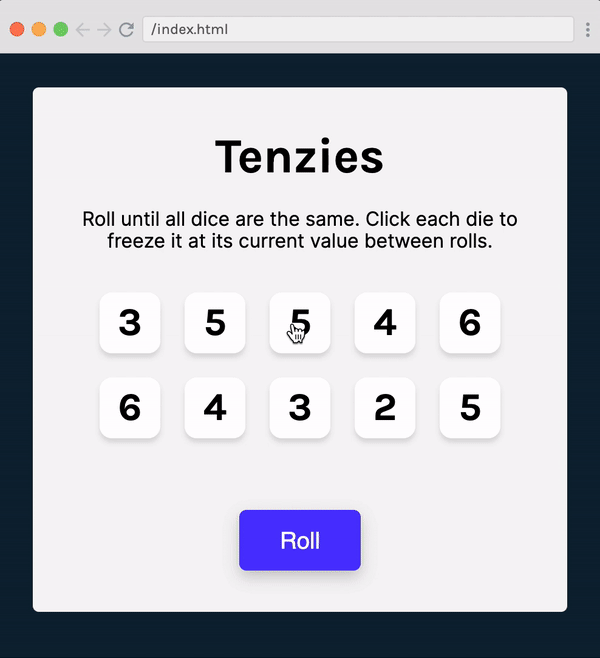

# 🎲 Tenzies

[](https://opensource.org/licenses/MIT)
[](https://reactjs.org/)
[](https://vitejs.dev/)

A fun and engaging dice game built with React! Roll dice, hold your favorites, and try to get all ten dice showing the same number. Complete with confetti celebration and accessibility features.

## 📖 Table of Contents

- [Overview](#overview)
- [Features](#features)
- [Preview](#preview)
- [Installation](#installation)
- [Usage](#usage)
- [Game Rules](#game-rules)
- [Technologies Used](#technologies-used)
- [Project Structure](#project-structure)
- [Contributing](#contributing)
- [License](#license)
- [Acknowledgments](#acknowledgments)

## 🎯 Overview

Tenzies is a digital adaptation of the popular dice game where players race to get all ten dice showing the same number. This React implementation features a clean, accessible interface with visual feedback and celebratory animations.

## ✨ Features

- 🎲 **Interactive Dice Rolling**: Click to hold dice at their current value
- 🎉 **Victory Celebration**: Confetti animation when you win
- ♿ **Accessibility Support**: Screen reader friendly with ARIA labels
- 📱 **Responsive Design**: Works great on desktop and mobile devices
- 🎨 **Clean UI**: Modern, intuitive interface with smooth interactions
- 🔄 **New Game**: Instantly start a fresh game after winning

## 🖥️ Preview

See Tenzies in action:




## 🚀 Installation

### Prerequisites

- Node.js (version 14 or higher)
- npm or yarn package manager

### Steps

1. **Clone the repository**
   ```bash
   git clone https://github.com/bakadja/tenzies.git
   cd tenzies
   ```

2. **Install dependencies**
   ```bash
   npm install
   ```

3. **Start the development server**
   ```bash
   npm run dev
   ```

4. **Open your browser**
   Navigate to `http://localhost:5173` (or the port shown in your terminal)

## 🎮 Usage

### Development Commands

```bash
# Start development server
npm run dev

# Build for production
npm run build

# Preview production build
npm run preview
```

### Playing the Game

1. **Start**: The game begins with 10 dice showing random numbers (1-6)
2. **Roll**: Click the "Roll" button to roll all unheld dice
3. **Hold**: Click individual dice to hold them at their current value
4. **Win**: Get all 10 dice showing the same number
5. **Celebrate**: Enjoy the confetti and start a new game!

## 📋 Game Rules

- **Objective**: Get all ten dice to show the same number
- **Gameplay**: 
  - Roll the dice to get new random numbers
  - Click dice to "hold" them (they turn green and won't change on future rolls)
  - Continue rolling until all dice show the same number
  - Held dice maintain their value between rolls
- **Victory**: When all dice show the same number and are held, you win!

## 🛠️ Technologies Used

- **React 18.3.1** - UI library for building the interface
- **Vite** - Fast build tool and development server
- **nanoid** - Unique ID generation for dice components
- **react-confetti** - Celebration animation library
- **CSS3** - Styling and responsive design
- **Google Fonts (Karla)** - Typography

## 📁 Project Structure

```
tenzies/ 
│── App.jsx          # Main game component
│── Die.jsx          # Individual die component
│── index.jsx        # React DOM rendering
│── index.css        # Global styles
│── index.html       # HTML template
├── package.json     # Dependencies and scripts
├── vite.config.js   # Vite configuration
└── README.md        # Readme
```

## 🤝 Contributing

Contributions are welcome! Here's how you can help:

1. **Fork the repository**
2. **Create a feature branch**
   ```bash
   git checkout -b feature/amazing-feature
   ```
3. **Commit your changes**
   ```bash
   git commit -m "Add amazing feature"
   ```
4. **Push to the branch**
   ```bash
   git push origin feature/amazing-feature
   ```
5. **Open a Pull Request**

### Development Guidelines

- Follow React best practices and hooks patterns
- Maintain accessibility standards (ARIA labels, semantic HTML)
- Write clean, commented code
- Test your changes across different devices
- Ensure responsive design principles

## 📄 License

This project is licensed under the MIT License - see the [LICENSE](LICENSE) file for details.

## 🙏 Acknowledgments

- **Game Design**: Based on the classic Tenzies dice game
- **Fonts**: [Google Fonts](https://fonts.google.com/) for the Karla typeface
- **React Community**: For the excellent ecosystem and tools
- **Vite Team**: For the lightning-fast development experience

---

<div align="center">

**[⬆ Back to Top](#-tenzies)**

Made with ❤️ and React

</div>

